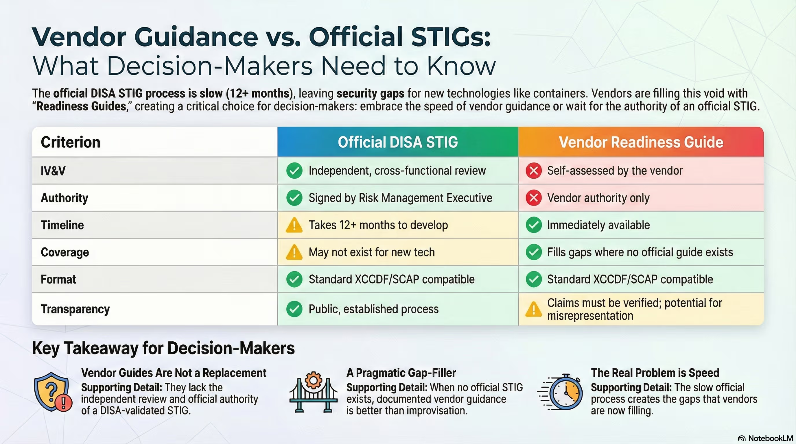

## Preface

I just went to Chainguard Assemble 2026 earlier this week and since then I have been looking to refine what I learned into a reflection and even boost that learning with more research and more questions.

That is where this article is coming from. It is the first in a series of articles I will be writing where I take a confusion point I had with Chainguard and write what I learned / am learning on the topic.

The core question for this article is: ***Why is Chainguard self publishing STIGs?***

## Understanding the Opposition

This is where we can get into the source of my confusion. Generally I really like what Chainguard does think highly of them but the points made here also were making a lot of sense so let's get into them.

This article is the opposition source that I stumbled into earlier on why a self published STIG may not be a good thing.

> [Self-Published STIGs Are Not a Breakthrough — They’re a Breakdown](https://www.linkedin.com/pulse/self-published-stigs-breakthrough-theyre-breakdown-sienkiewicz-%25E9%2587%2591%25E5%2587%25B1%25E6%2597%258B-oa7he/?trackingId=SbJqVUYSTUmdKDP8URJRSQ%3D%3D)

I recommend reading the article to get a better understanding but my basic read of it followed by some additional research was that STIGs are not just a hardening checklist. They are a **DISA signed checklist** for hardening plus automated scanning later. The point here of STIGs is the government stamp of approval coming from the vigorous DISA accreditation process.

The issue doesn't come from publishing a hardening checklist that is scan format compatible. It is coming from claiming Fedramp compliance on the STIGs front with a STIG that has not been submitted to DISA and accredited by them independently of the vendor.

So are the Chainguard STIGs no good or at least shouldn't fall under STIG name?

To the first claim there, firm rejection. They are definitely highly valuable for ensuring more secure containers.

To the second, the more I learn the more I believe the name is valid but I can still see the murkiness. The Chainguard blog and docs makes a few points of special note here including:

1. "How a STIG applies to an image are vague and not easily digestible."
   [STIG hardening container images](https://www.chainguard.dev/unchained/stig-hardening-container-images)
2. "With a properly locked down hosting environment, containers inherit most of the security controls and benefits from infrastructure to host OS-level remediation requirements."
   [DISA - Container Hardening Process Guide - Section 5](https://dl.dod.cyber.mil/wp-content/uploads/devsecops/pdf/Final_DevSecOps_Enterprise_Container_Hardening_Guide_1.2.pdf) (in above Chainguard blog article)
3. "A STIG is akin to the implementation of a Security Requirements Guide (SRG)"
   [Image STIGs - What are STIGs?](https://edu.chainguard.dev/chainguard/chainguard-images/features/image-stigs/#what-are-stigs)
4. "The process from a STIG being submitting to it being published by DISA can take years"
   [Image STIGs - What are STIGs?](https://edu.chainguard.dev/chainguard/chainguard-images/features/image-stigs/#what-are-stigs)

The interesting thing here is the aforementioned article agrees here with Chainguard about what I think of as the ecosystem issue. Every piece of software from the lowest level to the highest is a connected stack with shared ecosystem responsibility and danger.

> The argument Chainguard and others advance — that modern containerized environments need a more agile STIG process — is sound. But their conclusion is precisely backward. The ephemeral nature of containers makes independent validation more essential, not less. As I have begun to develop my theory of a cybersecurity Unified Linkage Model (ULM), container security depends on a chain of inheritance:
>
> - the host kernel,
> - the container runtime,
> - the image base,
> - the orchestration layer,
> - and the CI/CD supply chain.
> 
> Each of those layers inherits risk from the previous one.

The main conflicts I am getting here are these

1. Chainguard's position here is filling the gap left by DISA currently with their own self published STIGs is better than accepting the gap as it is.
2. Chainguard's outreach does make it clear that the STIGs are self published based on the General Purpose Operating System SRG which for those who understand the space makes it a clear non-DISA equivalent but not for everyone. The language fits the word description better than it does warning for those not so familiar with STIGs. 

Now there are two important pieces to chew on. The gap DISA has left and the flavor of the outreach from Chainguard.

## The Gap to Be Filled

As the gap is concerned this article is a great help.
[When Vendors Write Their Own STIGs: Independence, Velocity, and the Container Security Reckoning](https://www.stigviewer.com/blog/when-vendors-write-their-own-stigs-independence-velocity-and-the-container-security-reckoning)

They have a really nice info-graphic covering to core points so here is that

There are three really important excerpts from this to take

> 1. Picture this: You're an AO three months into a container modernization effort. Your team deployed Kubernetes workloads last quarter. The architecture is elegant. The DevSecOps pipeline hums. And then someone asks the question nobody wanted to hear: "Where's the STIG?"
>    
>    You check DISA's library. There's a Container Platform SRG. Kubernetes has a STIG. Docker Enterprise has one too. But your container images? The actual base images running inside those pods? Nothing. Not a single official STIG exists for generic container images.

> 2. Boeing 737 MAX proved the principle extends beyond cybersecurity. Congress found the FAA "trusted but did not appropriately verify." The regulator deferred to the manufacturer. People died.
>    
>    So when Sienkiewicz calls vendor-published security guidance "the digital equivalent of grading your own exam," he's channeling institutional wisdom earned through failure. Independence matters. IV&V isn't bureaucratic ritual. It's how assurance actually works.

> 3. VMware vSphere 8.0 released in October 2022. The STIG dropped October 2023. Twelve months. That's for a hypervisor with a stable release cadence and established vendor relationship.
>    
>    Containers don't work that way. Kubernetes workloads are ephemeral by design. Images rebuild nightly. Vulnerabilities emerge continuously. The threat landscape doesn't pause while the validation process catches up.

Point 3 is a bit of an exaggeration as well for complex STIGs with a new major version it may take 12 months, DISA puts out regular updates and releases (not an initial release) every quarter which is far quicker.

Moving past that, when I look at these arguments and I consider what STIGs was made for

> "A standardized and customizable set of rules for installing, supporting, running, and securing systems in the government against cyberattack."
> > https://www.steelcloud.com/what-are-stigs/

I can see why something is much better than nothing. STIGs were developed out of a real world need for what they provide and having something to that effect even if not officially signed is better than nothing. STIGs are there to help secure systems and check that systems are secured. That's a benefit you want compliance or no really.

That something benefit is also why it makes sense that achieving Fedramp compliance via vendor self published STIGs is allowed. It is predicated on the condition of no DISA STIGs being available so fallback is taken.

> “The service provider shall use the DoD STIGs to establish configuration settings; Center for Internet Security up to Level 2 (CIS Level 2) guidelines shall be used if STIGs are not available; Custom baselines shall be used if CIS is not available.”
> > CM-6 (a) Requirement 1 of the Federal Risk and Authorization Management Program (FedRAMP) System Security Plan

## The Murky Side Here: Outreach

So the main issue that remains is the marketing. The STIG viewer team said this

> "Read Chainguard's DISA STIG Commitment page. They don't claim DISA approval. They explicitly state their guidance aligns with the General Purpose Operating System SRG. They call it a "STIG Readiness Guide," not an official STIG. They use "commercially reasonable efforts" language. The transparency is unusual by vendor standards."

It's not wrong and it makes sense but I want to push back here and actually lean on the other side of the argument.

When Chainguard
- releases a blog post titled 
	- "Chainguard’s STIG-Hardened FIPS Images now generally available"
- says 
	- "If you are a commercial or enterprise organization seeking to achieve or enhance your FedRAMP compliance status, **Chainguard STIG hardened FIPS Images are the perfect solution. With hardened FIPS images, a dedicated STIG**, and expert support, you can streamline your compliance and vulnerability management requirements, and focus on what matters most: unlocking your business potential."
- uses the wording
	- "Chainguard STIG hardened Images"

Their DISA STIG commitment page changes the wording from "Chainguard STIG" to "Chainguard DISA STIG".

Then a misunderstanding feels like a pretty natural byproduct. It's where I came from before I took a good amount of time to educate myself on the topic.

While it is reasonable to expect someone considering STIGs as a benefit from Chainguard to do further research beyond a blog title or marketing call out and it is reasonable to expect someone to interpret Chainguard STIGs for the position they hold based on the SRG and the commercially reasonable efforts claims, this messaging leaves the waters murky.

I get that Chainguard is a business trying to sell a product and I think that what they're making is great. However, when you make a viewer of your outreach interpret what the service you're providing is and is not and what your position on the official solution is then it feels a bit disingenuous.

Currently, the only mention of the official process is why it does not work and how they are using GPOS SRG controls narrowed down to those that are applicable for containers. 

Both of which are great but when you

1. title your solution both "Chainguard STIG" and "Chainguard DISA STIG"
2. claim your solution is perfect in the context of FedRAMP
3. describe how the official solution is no good

Then follow that up with no public claim to still trying to go through the official process and work out a solution with DISA then it becomes unclear whether Chainguard is just positioning itself as a better alternative solution instead of a fallback. This is at least how it looked from my layman perspective before digging into this topic.

A possible alternative to this is making a clear and direct warning admission using the likes of the info-graphic above as well as claiming to be currently going through the official process with a clear short explanation of the difficulty plus time consuming and private nature of that task as well as being a little less idealistic with the marketing. Maybe this is just my inexperience but keeping the honesty standard for marketing high in regards to topics like STIGs and FedRAMP compliance seems best even if it is a little less customer eye-catching.

## Final Thoughts

So going back to my starting question for this section of "Why is Chainguard self publishing STIGs?"

Because people understand what STIGs provide and want those benefits for their container images so an interim fallback solution that people can recognize in the STIG space is called on.

The current Chainguard STIG hardened FIPS Images are **not** the perfect solution but they are a great solution for the industry to have when the perfect solution isn't there.

## Thanks

With this article done I want to give a big thanks to Chainguard for publishing what they have on STIGs, answering my questions about STIGs, and doing what they do.

While I may have taken the issues I did with the outreach here, there is a lot of good things to be said about it to. I just find it more constructive to work through the issues I see. Particularly their article "STIG hardening container images" is one I recommend for kicking off any technical learning on the topic if you find yourself interested and are not already a STIGs pro with an understanding of how they fit in the Chainguard space here.

> https://www.chainguard.dev/unchained/stig-hardening-container-images
