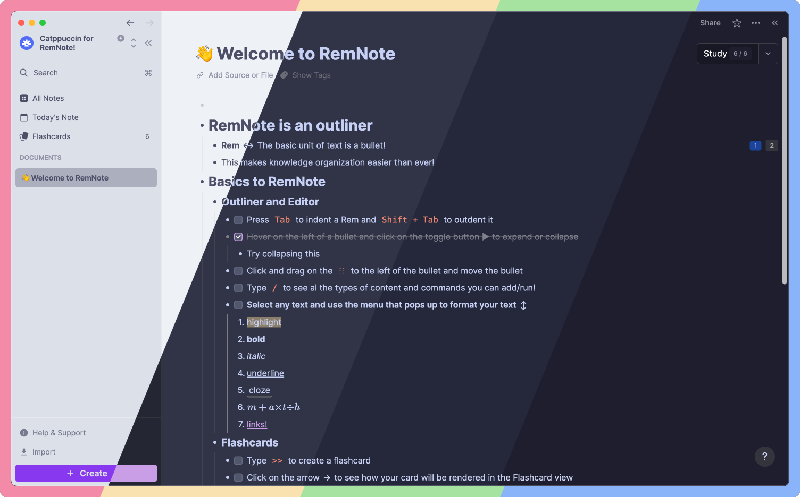
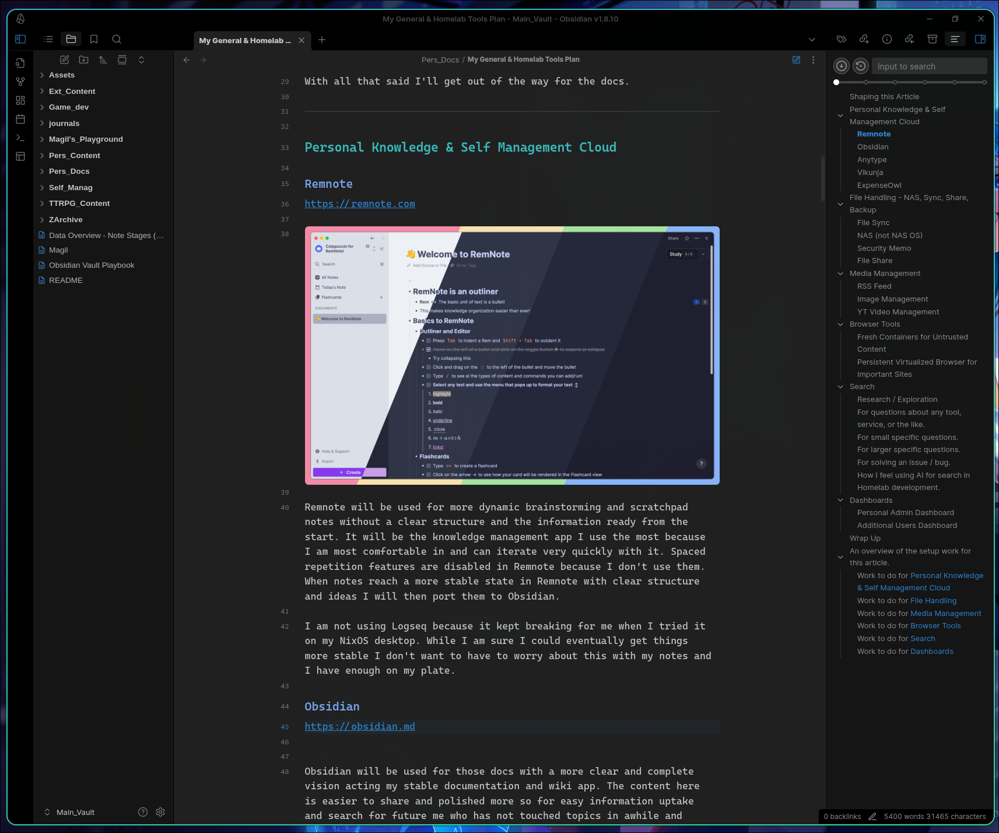
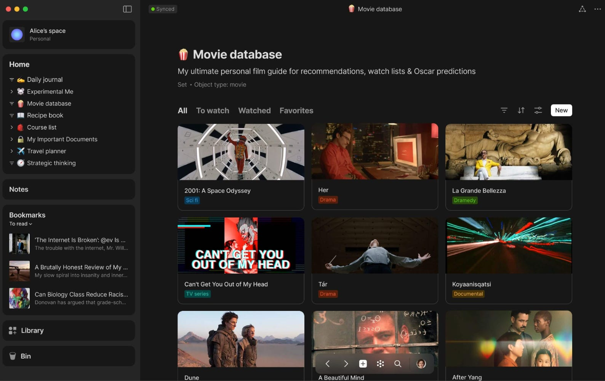
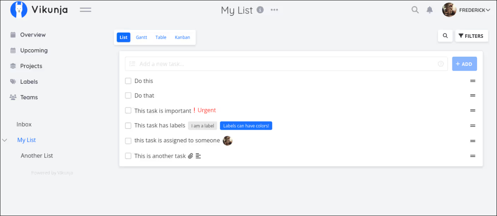
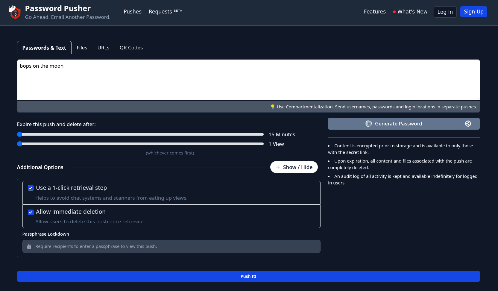
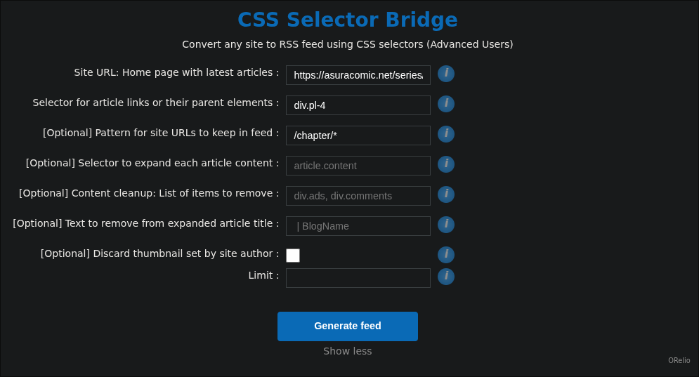
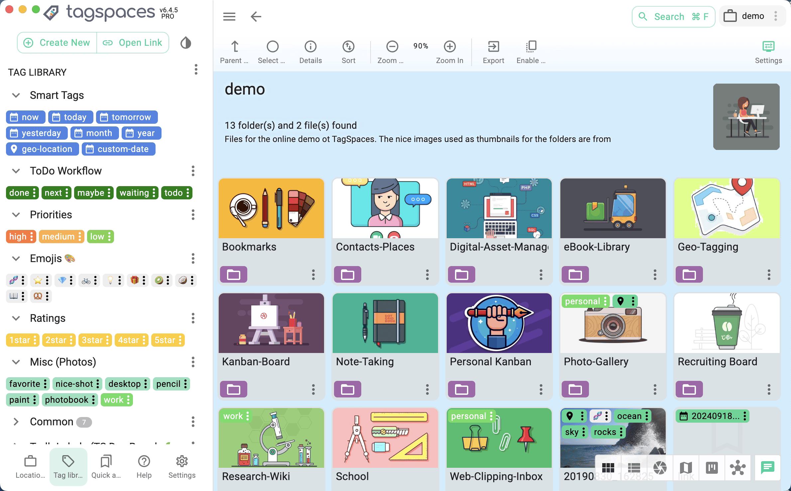
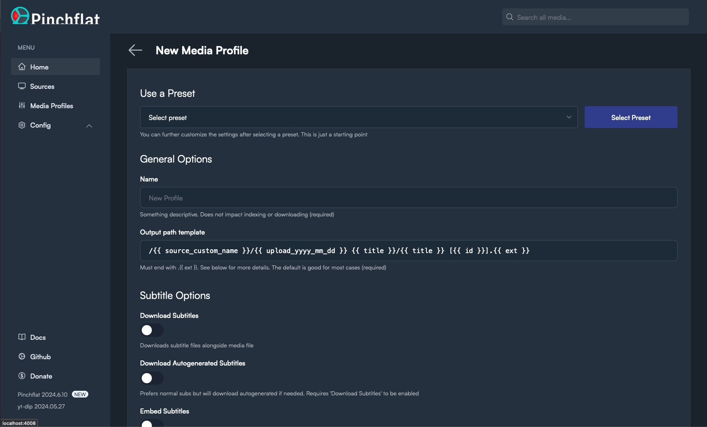
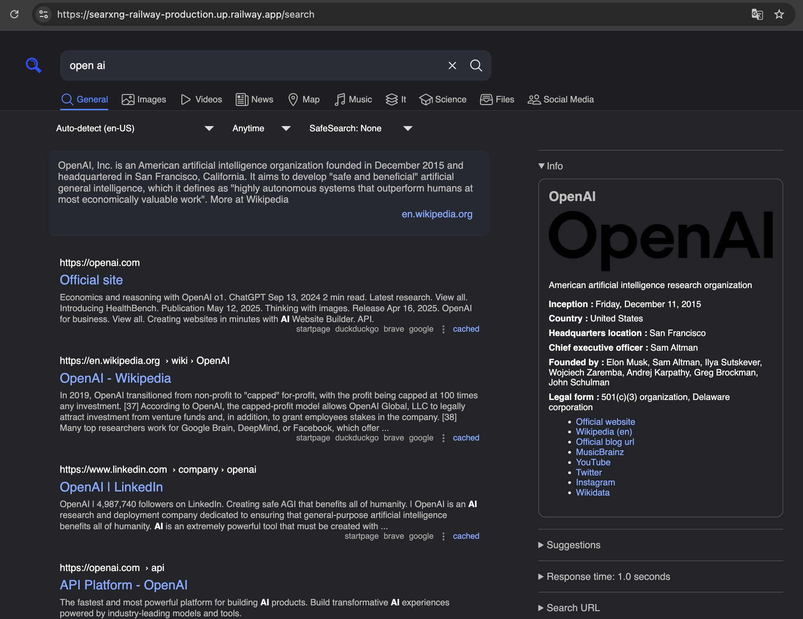
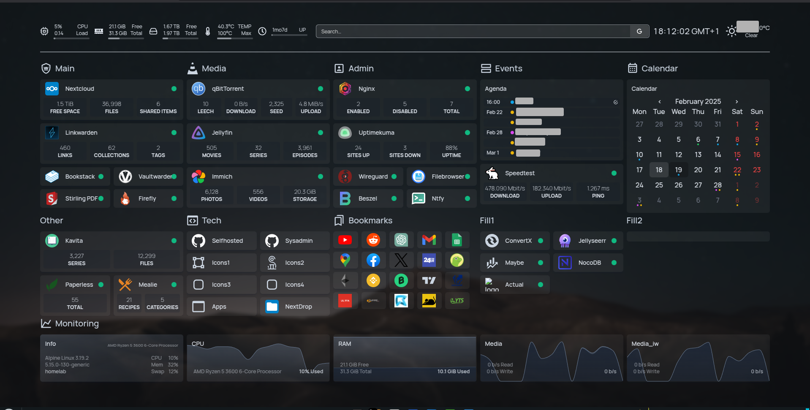

### Shaping this Article

Apps like Obsidian and managed services in the cloud that I don't host like YouTube are included here to show everything the services in my Homelab are interfacing with to make the connections and purposes of everything more clear so that reading this becomes a more useful experience with everything on the table.

The research here started as just wanting to own my data but it has become a lot more than that as I really honed in on what tools and services could really enhance the way I do things from the likes of media management to altogether changing how I use the browser.

For as much time was dedicated to looking for tools and services I didn't know existed more was dedicated to looking deeper at the ones I knew of and found but didn't didn't know *about* in the context of how they may fit me.

My research that shaped this article was rail guarded with five main guidelines.
1. I would not be including Homelab operational utilities.
2. I would not be setting up any tools or services with high risk.
3. I would not compromise on security.
4. I would avoid bloat and unnecessary tools.
5. I would be documenting all my decisions so they needed to be well thought out.

By operational utilities I mean things my Tailscale, Traefik, Grafana monitoring stack, Dnsmasq, and others. There are enough of the basics there already setup for me to be able to focus on end services for me to use during this feature push in the Homelab. Also, a big part of getting all of these services up and running now is so that as develop more automation, monitoring, and security in the Homelab they can be built around the end services I have in mind.

High risk exists at two ends here where one is inviting danger into the Homelab with say torrenting. While I know this can be done safely I am paranoid and also using this as a motivation booster for improving the security in my Homelab so it will wait for now. On the other end are cases like my password manager where the contents of the service are extremely important and I have far more faith in the current security Bitwarden has around their infrastructure than what I have in my Homelab yet even if the attack target is smaller.

Security is very important to me so with this in mind if a tool or service ever feels like it could pose a risk whether from a lack of maintenance or bloated code app for my needs increasing attack surface, then I will try to find another way.

That is the first part of my motivation to avoid bloat and tools I don't need with the other two being my limited hardware resources to work with along with the focus issues that I already have.

A big part of my plan to help future me focus with all these tools and services is making sure everything has already been well thought out and documented for him to read so the purpose of everything is clear. Because of this the article while containing a lot of personal opinions and thoughts is leaning far more on the side of piece of documentation than a humor filled article to read for fun.

Lastly, everything here is awesome and fun to learn about and tinker with for me. Improving my personal tooling is something I really enjoy along with trying new services and tools. When writing some sections of this article I found myself getting excited as I realized how cool tools like a persistent browser or a special YouTube downloader service and more really are.

With all that said I'll get out of the way for the docs.

---

### Personal Knowledge & Self Management Cloud

#### Remnote
https://remnote.com

Remnote will be used for more dynamic brainstorming and scratchpad notes without a clear structure and the information ready from the start. It will be the knowledge management app I use the most because I am most comfortable in and can iterate very quickly with it. Spaced repetition features are disabled in Remnote because I don't use them. When notes reach a more stable state in Remnote with clear structure and ideas I will then port them to Obsidian.

I am not using Logseq because it kept breaking for me when I tried it on my NixOS desktop. While I am sure I could eventually get things more stable I don't want to have to worry about this with my notes and I have enough on my plate.

#### Obsidian
https://obsidian.md

Obsidian will be used for those docs with a more clear and complete vision acting my stable documentation and wiki app. The content here is easier to share and polished more so for easy information uptake and search for future me who has not touched topics in awhile and other people.

Another use will be "stable visual canvas" documentation whether that be Excalidraw diagrams, proper Obsidian canvas files bringing together a few docs into one topic, or a visual aide to a separate doc.

*Visual Canvas Brainstorming - Separate Obsidian Vault*
Obsidian will be used for this purpose because I trust its Excalidraw editor more, it stores the boards, and offers nice canvas features without me needing to install or host anything else.

*Calendar, Habit Tracking, and Journal Setup - Separate Obsidian Vault*
Obsidian will be used for this purpose because
- it offers a seamless way to integrate journal and Calendar
- it offers a very nice UI available on all my devices for free
- it is very low setup work
- it integrates into my backups setup nicely
The con here is that this will not integrate with other apps like how Google Calendar or a self hosted CalDav solution which is fine for me.

This will work using the Full Calendar, Heatmap calendar, and Periodic Notes plugins in a separate Obsidian Vault for this utility. It will handle my time tracking (generally plus per habit) and reflections for each, reminders for appointments, and generally tracking time commitments. Project and task dates will be handled separately in the relevant service.

#### Anytype
https://anytype.io/

Anytype will contain collection data from my life which neatly falls into a database and have a more pretty UI for these things will galleries, image placement, and page layout capabilities.

It will be used instead of Notion because I don't need a lot of collaboration or cloud storage, really like the mission they are on, and in turn prefer their privacy and peer to peer approach. I will not be hosting it myself because it already provides end to end encryption in open source and it would be overkill for me to do considering the uses I currently see for the app.

#### Vikunja
https://vikunja.io

Vikunja will be used for project and task management. The small scale and feature set really appeals to me so I can just focus on getting things done with this service while having a nice UI and features specifically relevant all setup from the get go.

This is being used instead of Anytype for this purpose because my brain needs the streamlined set in stone experience this app provides. It won't work as a collaborative project manager so when I get into such a project or one where I am feeling the limits of Vikunja I may switch to Anytype for project management then.

#### ExpenseOwl
https://github.com/Tanq16/ExpenseOwl

ExpenseOwl will be used for personal finance management because it works well for the *very* small scale management I want without a bunch of additional features that are just bloat for my purposes. It also has a UI that I really like.

### File Handling - NAS, Sync, Share, Backup

#### File Sync
https://syncthing.net

Syncthing will be used for syncing and backup handling because it got recommended and vetted by people I respect, has a community I like around it, and is open source which while not a must is always liked. Another reason for this choice is the strict focus towards specifically file sync without adding on a file browsing client and a whole bunch of other unnecessary features for my use case here.

A special locked down Syncthing server peer will be made for always being available to maintain sync between devices that are on at different times. It will be a rootless and distroless container made with a custom Dockerfile using the Syncthing binary. This is for security as a lot of important data will pass through here including files going along different routes so prevent execution as much as possible here is important. Another instance will later be used for syncing potentially suspicious files with their backup location.

The untrusted devices feature will be used for syncing with locations that don't need knowledge of the synced files and are not a source of truth for the purpose of additional backups.

*Constant sync items who do not have a heavy sync cost.*
Large binaries and such files are generally not a part of these items meaning efficient block level sync can occur.

My development environments will be synced with Syncthing instead of git reducing conflict problems and also allowing me to focus git towards its main purpose of version control with meaningful commits. These environments include Godot projects, other apps, IaC projects, and more.
They will be synced across
- My PC - Linux boot
- My Laptop - Linux boot
- Locked Down Syncthing Server Peer - Container
Additional backups with untrusted devices will not be used here as three devices are involved along with GitHub existing not far out of sync provide a setup I can trust enough here.
---
My Obsidian vaults will be synced this way across
- My PC - Linux boot
- My PC - Windows boot
- My Laptop - Linux boot
- My Laptop - Windows boot
- My Phone - GrapheneOS
- Locked Down Syncthing Server Peer
- (untrusted device) Google Drive - Local File System Mirror
---
The normal (cheaper to sync) files in my user data which includes Downloads, Documents, Music, Pictures, and Videos will be synced this way with a special sync exception to separate more expensive files to sync.
They will be synced across across
- My NFS NAS - Container
- My SMB NAS - Container
- (untrusted device) Google Drive - Local File System Mirror

---
My two NAS container will be synced with each other each using a Syncthing sidecar container for this purpose.

This is done instead of a shared volume because the two container expose their file systems with different protocols meaning writing to that shared volume with two different protocols at the same time could happen leading to data corruption. Permission mapping which I will likely be using in the future also can break with a shared volume setup.

With Syncthing the permissions and corruption issues are handled but the issue of simultaneous write the two containers remains with the consequence of sync conflicts for Syncthing. This also doubles the storage usage but I will not be storing a large amount in these containers and no contents that are more expensive (require full file sync) so this is fine for me.

The sync conflict issue currently will not be addressed because it really is not a problem for me because there won't be a time when both modified at the same time. I am the only user of this synced two NAS container setup and will be accessing them using different devices. In the future I could look into guard railing this case by detecting when one container is logged into and based off that only allowing read only access login to the other.

*Schedule based sync items who have a heavy sync cost.*
Large binaries and such files that force full file syncs are the standard here. The schedule should notify me on PC when it is happening and be adjustable so it works well with my schedule for the day.

My creative projects will be synced on a schedule with Syncthing most of the time purely for backup purposes as my main creative workstation is my Linux PC but sometimes also for splitting work across multiple devices. Examples of software that may be used in these projects include Blender, Krita, and Davinci Resolve to name the main few that come to mind.

It is hard to say what devices will be synced across when I don't know the project but here is the baseline.
- My PC - Linux boot
- Locked Down Syncthing Server Peer
---
The special and large files in my user data which includes Downloads, Documents, Music, Pictures, and Videos will be synced this way using special sync exceptions to separate these files meant to sync on a schedule.
This will be synced across
- My NFS NAS - Container
- My SMB NAS - Container
- (untrusted device) Google Drive - Local File System Mirror
---
Data and config files from my service containers will be synced this way. This sync setup is only an interim solution until a later security feature push which will focus on making sure the service data is secure along with a few more things outside the scope of this article.
This will be synced across
- Server Syncthing Peers (on hosts with mounted directories for all the services)
- My PC - Linux (has a large drive for backup purposes)

#### NAS (not NAS OS)
The ghcr.io/servercontainers/samba docker container will be used for my SMB server because it is actively maintained and I like the documentation.

The ghcr.io/obeone/nfs-server docker container will be used my NFS server because it is the most up to date image and the documentation plus features are good. I looked over the code because it is not a mainstream image and it seemed fine.

Docker containers are being used here because of the convenient setup plus up and down functionality they provide. Two containers with different file server protocols are being used because they both offer different advantages I want. NFS is faster being made for Unix systems which are my main devices. SMB is slower but support all my other devices non-Unix devices: Windows and GrapheneOS.

With this setup I will always have access to my network attached storage on my various devices and have a faster connection on my main Linux devices.

For NAS users there is currently just me but in the future I will have NAS setup for different groups to share like my family and D&D group. 

As contents go there will be my user data which includes Downloads, Documents, Pictures, Music, and Videos. Previously I had a private data partition on my PC where this data was kept and mounted to whatever Linux distribution I may be using, this setup will nicely replace that keeping the separation of data from OS but sharing it with more devices.

*Storage Setup with Proxmox*
These NAS containers will exist on a Proxmox managed Debian VM which has an ext4 directory mounted on. In that directory is a sub-directory for NAS usage. All directories I make to be mounted in a NAS will be inside this NAS focused sub-directory meaning I can generally provide NAS storage and the different NAS directories will expand as they individually need to fit this space.

*Side Case - Secure private cloud for collaboration without using my infrastructure.*
https://cryptomator.org
Cryptomator can be used with Google Drive and the like. Currently I have no use for this but it is nice to have in my back pocket.

#### Security Memo
For my current standing there is
- Tailscale providing identity and access control with grants as well as encrypted traffic.
- Syncthing relays and such will be disabled as I will handle the networking privately and fast with Tailscale.
- Each NAS container is alone on their own local network with their only two network interfaces for communication being a Macvlan interface for Tailscale direct connections and the Tailscale interface itself (sidecar setup).
- The locked down source of truth Syncthing server peer which is rootless and distroless, also alone on its own local network like the NAS containers.

For my future standing there are a few plans.
- As part of the later security feature push I mentioned earlier and another there is monitoring and checks via Kestra and my monitoring stack to make sure sync devices are trustworthy. as well as monitoring and checks via Kestra and malware scanners.
- For user management later I may get into multiple instances for a simple solution for my small amount of users or setting Kerberos NFSv4 with an LDAP as well as proper shares for SMB which would act as another layer of defense behind Tailscale.

#### File Share
The idea here is one time sharing files with someone privately who am not synced with and don't have a shared NAS server with.

https://eu.pwpush.com/

The only service I will be self hosting here is Password Pusher which is used for securely send information by creating a URL to access a private text entry, file up to 4GB, or URL. This URL has custom time to live setting and amount of reads before it self destructs as well as audit history on those reads. For files less than or equal to 4GB I will use solely use Password Pusher.

For files greater than 4GB I will use [https://transfer.zip](https://transfer.zip)

It is an open source tool that allows me to send files of any size using their managed service without an account for quick peer to peer transfer whose only limitations are no storage and the browser tab must stay open on both ends.

Because the tool is open source with a solid design, most transfers of this size will just use transfer.zip only.

In cases where the contents are particularly private to feel comfortable sending them through this managed service I will take an out of band encryption approach. Meaning I will encrypt the transfer file(s) before uploading them to transfer.zip with some kind of key. Password Pusher is used to make a URL container for that key to send to my intended recipient who can then use it to decrypt the received file.

The managed service of transfer.zip is being used with this encryption approach instead of self hosting because the presumption is my share partner is not connected to my infra and I don't want to publicly expose the service myself.

This process can be repeated from them back to me without using my infrastructure at all only requiring that they use the managed Password Pusher and transfer.zip services. The two services while being managed out of house should not know about each other so the end data should be secure and private still.

For encrypting the files there are two options I'm looking with one for technical share partners and the other one for non-technical share partners which can expect far more use.

*Non-Technical: Picocrypt*  --  https://github.com/Picocrypt/Picocrypt

The Picocrypt tool was just archived two days ago (August 4th, 2025) but going off the research I did and some thought I have decided to still use it and recommend to share partners. This is because the project has been brought to a very stable place with an audit passed, no bugs, the encryption solid, and no concerning problems needing development aside from assuring future mac support. That issue is based on OpenGL being marked as deprecated which has no clear fallout day yet. For a tool like this I would be more concerned with overly active development. In the end the UI is great for non-technical users which is a large part of why I am picking it.

*Technical: Age Key*  --  https://github.com/FiloSottile/age

*Direct sharing on a local network.*
Here the same approach around transfer.zip can be used over a managed service like PairDrop or Blaze for fast and simple peer to peer transfer locally.

For more back and forth sharing beyond this with a high security and privacy requirement and public infra, Cryptomator with a cloud storage provider should be used.

### Media Management

#### RSS Feed
https://github.com/RSS-Bridge/rss-bridge

RSS-Bridge will be used for generating RSS feeds for sites without native RSS links that CommaFeed can use.

https://www.commafeed.com/#/welcome

CommaFeed will be used for my RSS feed because I really like the UI look and feel with the simple but clean organization.

#### Image Management
https://www.tagspaces.org/

Tagspaces will be used for keeping track of all my images by tags, spaces, and date. This way the large amount of screenshots I have from comics, memes, artwork that I really like, and few photos can be nicely organized with manually added metadata for easy searching.

I am trying Tagspaces instead of a service like PhotoPrism or Immich for now because it feels more focused towards manual but easy image organization and search with metadata with a smaller focus on photo management and all that comes with that which doesn't really matter for me.

#### YT Video Management
https://unhook.app
In YouTube I block the recommended with the Unhook browser extension and use search, known channels I like, and direct referrals from them for finding content to watch with I place in playlist which is where I generally browse around for the content I want to watch.

https://github.com/kieraneglin/pinchflat

https://jellyfin.org

Pinchflat will be used for syncing these YouTube playlists to Jellyfin where the app would work better with my library focused approach compared to the YouTube web app library which is not great.

Storage is not a concern as an hour and 15 minute video downloaded with yt-dlp is around 440 MB with good video and audio quality at least as I'm concerned in the webm format which Jellyin supports directly, no conversion needed.

Additionally, from this setup I get offline viewing and backups of the saved video I have watched and organized which I really liked.

### Browser Tools

#### Fresh Containers for Untrusted Content
https://kasmweb.com/
Kasm Workspaces will be used for generating a fresh containerized browser session for going to sites I don't trust. Kasm supports multiple users with their own individual environments which is important for when I make this service available to my family and friends.

https://sqrx.com/
SquareX is a browser extension connecting to cloud managed infrastructure which I can easily use where I may not have access to my Kasm instance and don't need a longer session like an hour to two. It is also useful for generating temporary emails, checking email attachments, and such downloads which are uncertain.

These tools are also useful for testing browser extensions I am not sure about.

#### Persistent Virtualized Browser for Important Sites
https://neko.m1k1o.net
Neko will be used for generating a persistent browser with the profile, cookies, extensions and more all pre-configured and locked in place. It will be logged into my important site like Tailscale, Remnote, GitHub and more so that the session content for these websites is kept separate from my more general use browser.

Compared to simply using another browser on device this has the advantages of stricter browser lock down, allowing me to use Brave here alongside my main Brave app, and being setup for plus available to all my core devices. Since I would only have these sites logged in on this browser, the amount of surface area where they can be reached goes down.

The browser instance itself can also be locked with Authentik forcing authentication with access only being possible via Tailscale which adds another layer of identity checking and keeps my access to the browser session encrypted.

Neko is here alongside Kasm because Kasm is where all the untrusted links go and it will be setup in an appropriate zone in my infrastructure for that role. Neko is much more lightweight and purpose built towards the browser compared to Kasm making it the better choice for my second “virtualized browser instance” though really Kasm is so much more than that which is why Neko wins here.

### Search
With this section everything is already in use but I still wanted to document it here because it is a part of the tools and services I use including SearXNG which is self hosted.

#### Research / Exploration
ChatGPT and Grok will be used for learning about potential approaches and existing tools to use for a task. SearXNG will also be queried but the AI is good for getting an idea of what is what is out there when I don't quite know what I am looking for.

#### For questions about any tool, service, or the like.
https://github.com/searxng/searxng

SearXNG is used for finding documentation and other good human written materials on the item(s) in question like blogs and so forth. Beyond the privacy component of using Google it simply just does not work so well now and I feel the results from SearXNG are far better.

#### For small specific questions.
Gemini straight from the Google search will be used for very small and specific questions because it can be quickly reached and has a nice small format with attached links for these small questions. In the future I may start using ephemeral mode for say ChatGPT but for now Google works nicely here.

#### For larger specific questions.
ChatGPT will be used for the larger still specific questions like generating a specific piece of Jinja that I can clearly explain. Then I do further testing and research on what I get here to get where I want to.

#### For solving an issue / bug.
When the problem has few moving parts and involves little in-house tinkering such as an issue with using a stock installed tool for default purpose then I will provide configs and/or describe actions taken to ChatGPT.

On the other hand when the problem components are not out on the internet and/or the problem involves multiple uncertainty points the approach is more in depth
- SearXNG: check the tools, services, and the like to learn more about the foundation of what I am working on
- ChatGPT: clarify how very specific bits of configuration are expected to work, what might I have missed/misunderstood
- Google Search AI: clarify small uncertainties, personal sanity checks

*Improving My Problem Solving Ability*
ChatGPT and Grok will be queried about possible debugging approaches plus tools for helping to solve the problem. SearXNG will also be queried as best I can here.

The idea with the AI here is to be more focused on the abstract thing I am looking into, eg. network traffic instead of traffic between two specific containers in a specific situation. Don't add details that will confuse the AI and send the both of you down a inefficient rabbit hole to nowhere.

#### How I feel using AI for search in Homelab development.
The lack of privacy feels a bit bad but everything that is part of my Homelab I am publishing anyway so altogether I don't feel that bad about it. For the same reasoning the use for training of my ideas and what code I do provide doesn't feel bad either because it is all publicly available and beyond that everything I am doing is so basic and done a million times that it doesn't feel like the AI is taking anything special I have.

The place this will change is when I work on projects which are closed source and especially when it may be something where the ideas are far more original to myself with a planned release. In these cases I would be self hosting it locally without giving it an internet connection so no forwarding, privacy compromise, and training happened but because of my hardware limitations I simply won't be using AI for these projects.

Any further thoughts I have on AI will be left out of here as they go beyond the scope of this article.

### Dashboards

#### Personal Admin Dashboard
https://gethomepage.dev
[reddit post image source link](https://www.reddit.com/r/selfhosted/comments/1itatzq/work_in_progress_hobby_selfhoster_progress_of_cca/)

Homepage will be used here because I love the look of it and it also seems simple enough. I plan to use it as my new tab page with my link icons to my main sites along with everything around the Homelab.

#### Additional Users Dashboard
https://linkstack.org

Link Stack will be setup for additional users I get eventually for their dashboards as it support multiple users, is a basic link site, and has a solid look at its foundation with nice customization available.

---

### Wrap Up

That is all for now, next comes the work of getting everything here properly setup and the using everything here for awhile to properly get a feel for it all with what works well, better than expected, worse, and what gaps I can fill. While I am getting used to using all of this as I laid out, development will go back to Homelab operational utilities with a focus on my security tooling. Also some time will go back to my world building hobby which I really enjoy.

Finally I need to say thank you to all the amazing contributors to these FOSS projects that I am using who are doing incredible work and make this dream setup of mine possible. Thank you.

Thank you to the developers of products with solid free plans like Obsidian, Remnote, and more who are accommodating of folks like me with much money to spend.

Finally thank you for reading and have a good day wherever you are in the world. The next section is there to provide an easily scanned overview for anyone curious about the work to do for everything I described in the article.

### An overview of the work prompted by this article.

Note when I bring up Ansible role and Docker Compose this is relevant to how I am doing things in my project.
https://github.com/Daniel-Giszpenc/Homelab

#### Work to do for [[My General & Homelab Tools Plan#Personal Knowledge & Self Management Cloud|Personal Knowledge & Self Management Cloud]]
- [x] Configure Remnote (already long done)
- [ ] Configure Obsidian
	- [x] Folders setup. (already done)
	- [x] Tags setup. (already done)
	- [x] Docs for usage. (already done)
	- [ ] Additional canvas and life tracker vaults creation.
	- [ ] Full Calendar, Heatmap Calendar, Periodic Notes Plugin Combo
- [ ] Install & Configure Anytype
	- [ ] Install on all my devices.
	- [ ] Create cross-media database. (anime, comics, books, etc.)
	- [ ] Port Notion anime-media database data.
- [ ] Host & Configure Vikunja
	- [ ] Host
	- [ ] Setup project and tasks.
- [ ] Host & Configure ExpenseOwl
	- [ ] Host
	- [ ] Fill expenses.

#### Work to do for [[My General & Homelab Tools Plan#File Handling - NAS, Sync, Share, Backup|File Handling]]
- [ ] Self Host & Configure Syncthing
    - [ ] Self Host: Ansible Role & Docker Compose
    - [ ] Configure Google Drive mirrored files for untrusted Syncthing devices backups.
    - [ ] Configure: Constant Sync Items
        - [ ] Light User Data
        - [ ] Obsidian
        - [ ] Dev Environments
        - [ ] NAS Sync
    - [ ] Configure: Scheduled Sync Item
        - [ ] Heavy User Data
        - [ ] Creative Projects
- [ ] Self Host & Configure SMB & NFS NAS Servers
    - [ ] Self Host: Ansible Roles & Docker Composes
    - [ ] Port files to the correct NAS server.
    - [ ] Setup NAS directories for mounting.
    - [ ] Connect all my devices to the correct NAS server.
- [ ] Self Host Password Pusher: Ansible Roles & Docker Composes
- [ ] Install Picocrypt on my devices.

#### Work to do for [[My General & Homelab Tools Plan#Media Management|Media Management]]
- [ ] Self Host & Configure RSS-Bridge
    - [ ] Self Host: Ansible Role & Docker Compose
    - [ ] Generate feeds where required.
- [ ] Self Host & Configure CommaFeed
    - [ ] Self Host: Ansible Role & Docker Compose
    - [ ] Input my feeds.
- [ ] Self Host & Configure Tagspaces
    - [ ] Self Host: Ansible Role & Docker Compose
    - [ ] Port over my image collection Discord and files.
- [ ] Self Host & Configure Pinchflat
    - [ ] Self Host: Ansible Role & Docker Compose
    - [x] Create and fill organized playlists on YouTube. (already done)
    - [ ] Add my account cookie and playlists to scrape.
- [ ] Self Host & Configure Jellyfin
    - [ ] Self Host: Ansible Role & Docker Compose
    - [ ] Import media from Pinchflat.

#### Work to do for [[My General & Homelab Tools Plan#Browser Tools|Browser Tools]]
 - [ ] Self Host & Configure Neko
    - [ ] Self Host: Ansible Role & Docker Compose
    - [ ] Login to my important websites.
    - [ ] Clear all browsing data on my devices.
- [ ] Install SquareX Browser Extension on all devices.
- [ ] Self Host & Configure Kasm Workspaces: Ansible Role & Docker Compose

#### Work to do for [[My General & Homelab Tools Plan#Search|Search]]
- [x] Self Host & Configure SearXNG (already done)
- [x] Create ChatGPT and Grok accounts. (already done)

#### Work to do for [[My General & Homelab Tools Plan#Dashboards|Dashboards]]
- [ ] Self Host & Configure Homepage
    - [ ] Self Host: Ansible Role & Docker Compose
    - [ ] Add all my bookmark and Homelab content as I like it.
    - [ ] Set as my new tab page on all laptop and PC.
- [ ] Self Host & Configure Link Stack
    - [ ] Self Host: Ansible Role & Docker Compose
    - [ ] Setup a demo stack for my brother.

This may look like a lot of check boxes but all the services are very easy to host with no specially complicated inter-dependencies or networking problems to solve for them.