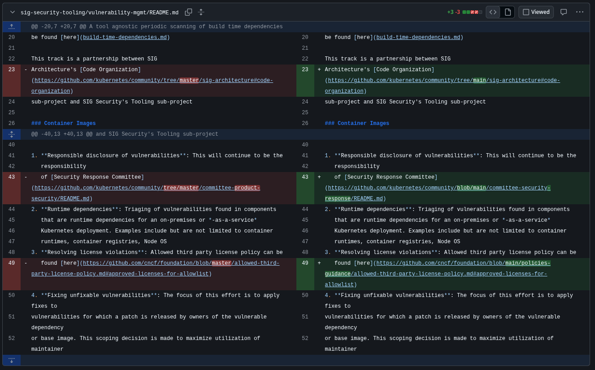

This article is going to be half me talking about my experience here and half my reflections / potential recommendations for anyone reading this in a similar boat.

## The story of getting to Kubernetes.

Before trying this out I had done a decent amount of work that was "open source" but all of it was just personal projects with only yours truly involved. The limits were starting to show from this: a lack of experience in large projects, a lack of experience working with people in tech, and a lack of record proof that I could do work in a bigger body of water. Aside from all the lacking going on I also have been leveraging open source for a long time. The idea of giving back and contributing has always been one of interest for me but for a long time I didn't have the confidence to do so alongside a project that really called out to me.

Coming closer to the present, every job listing I look at has Kubernetes slapped on and often golang as a friendly gopher companion. My personal projects have also gotten more mature and stable and my skills have reached a point where I still suck at everything kind of but I also feel confident picking up whatever I need to. Though some things may be much worse than others, looking at you shader programming.

So I made a goal of contributing to Kubernetes. It was half well reasoned plan and half impulse choice of "this is the thing that I keep getting told I need to get a handle on, let's just go all in". Of course, you realize that goal is a pretty broad one the moment you see the main Kubernetes repository and all the different sig and sub-project repositories and so forth alongside it. It really is quite a lot.

## Getting the lay of the land.

For that reason I took a solid amount of time taking a two mile wide two inch deep scan of the project focused on four things

**Project structure and governance**: Where is everything happening and getting decided?
- I had an alright idea of what things I was interested and good at but I needed to figure out where all of that coming from me could fit into Kubernetes. I also needed to learn how to learn about the project, break the problem space down into smaller parts that are easier to research and chew on.
- Kubernetes once you get to contributing can better be seen as an organization than a tool. Yes everything comes together in a set of finished solutions people can use but there is a lot of range.

**Communication approach**: The details of when, where, how, who.
- I wanted to get in the proverbial digital room with people and get familiarized with them in what they do, how they do it, and everything else they may introduce me to.
- Other people can always bring you to things that don't naturally rise up to your eyes. Also, one of the most amazing things about an open source project like Kubernetes compared to a personal project is being part of the community.

**Activity and need**: What part of the project could actually really use the help?
- I feel the most min-maxed contribution is one where I can help but that help can also cover some distance. That means looking at the status and history of open issues and PRs. Looking at the graveyard of issues and PRs gone stale and closed. Looking at what the longtime maintainers of the different project areas are saying.
- Kubernetes can be a great resume boost for sure but it's also a project that has people who rely on it and people who dedicate a lot of themselves to it. It's important in my eyes to respect the project and think about what would truly be helpful for it and not just your own interests.

**Save and organize**: Save everything I find of note and organize all of that.
- Kubernetes has a lot going on to find of interest, helpful, or both. The only way for all this work to truly be useful is to store it. Doing this also enables future work because now you've built organized places for what work you're involved in and what resources to draw on as you step into different project spaces.
- There is a lot to learn and a lot to do so giving yourself a foundation to context switch and on ramp off of is massively helpful.

## Following the river currents' momentum.

Two big interests of mine are infrastructure administration and security. With those often comes the world of DevOps. In Kubernetes this led me to the sig-security meeting on Friday which fit my schedule well and the Prow sub project of sig-testing which is the custom Kubernetes CI system. There was also a lot more stuff that looked interesting to dive into but it's best to not over-extend.

In the sig-security meetings I've been introduced to the work that they do, got my own little share of it, and really felt welcomed into the community. Everyone there has been great and without them I definitely would not feel as on track as I currently do. If you are looking for a sig to start working in as a new contributor they currently have a good amount of simple work to pick up.

In the Prow repository I've found quite a few issues and challenges that really interest me. Also, it feels like an awesome way to learn about Kubernetes for CI/CD (which I need to do for my career) is actually getting in the gears of their CI system. Sadly their meeting time is one that doesn't fit my schedule and I haven't had time to go beyond research and passerby work so far. Even still, it's definitely an amazing opportunity I wouldn't know about if I hadn't looked.

If you want to help out Kubernetes by the way, I recommend considering the Prow project as they currently are running on life support.

## Conclusion

I'm definitely happy I chose to invest time into contributing to Kubernetes and feel like already I have picked up some solid lessons.

Lesson #1: No one understands prow so don't feel bad (if you know you know).
Lesson #2: I've finally used the fork button, never needed to before.

Now in all seriousness I picked up more than that. I learned a bit about how a big project organizes (governance was very new), how they communicate (balance of different communication channels with different roles), how much work goes into a large project like this across many different fronts (so many significantly different sub-projects), and that everyone has something to offer (we all read a blog article someone else didn't).

I had an interesting moment in a new contributor meeting where there was an amazing guy, long time KubeCon speaker and a very experienced Kubernetes user but he still benefited from the resources I'd gathered.

I also got to learn that just as much as looking for work and projects that interest you in open source is a valid route, so is looking for people you want to work with and scanning projects you're not so sure about because there may be a sub project under the hood that really catches your eye.

Of course, everything here in the article is just about getting my feet in the water really. Now that I am more comfortable in the project with some direction and corners picked I can do a lot more. This is where another two benefits of having the community and project maturity of a project like Kubernetes comes in. The little units of work, even if they're not some grand completed solution can still act as a finished piece of work that people benefit from and there is a force to push me to keep working. Coming from a lot of solo work, these benefits are a pretty big deal for me. Too often the road to having something truly done was far too long and motivation in a vacuum is a harsh battle.

It's wacky how much pride can come from a git diff like this:

(my first contribution merged in)

